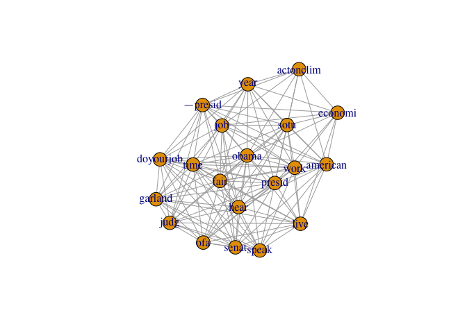
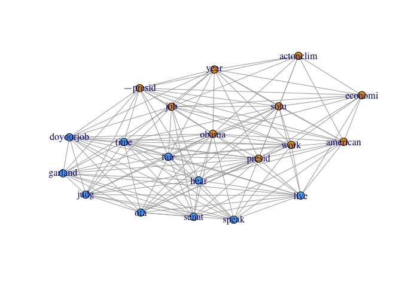

# Twitter_term_document_matrix
Hagai Levi  
9 April 2016  


```r
# This is based on http://www.rdatamining.com/examples/text-mining

setwd('/Users/hagai_lvi/tmp/data_scientist/assignment_3')
source('./credentials.R')
library(twitteR)

setup_twitter_oauth(consumer_key, consumer_secret, access_token, access_token_secret)
```

```
## [1] "Using direct authentication"
```

```r
maxID <- NULL
n_tweets <- 0
N_TWEETS <- 300
tweets <- NULL
while(n_tweets < N_TWEETS) {
  tmp <- userTimeline("BarackObama", n=200, maxID = maxID)
  maxID <- tmp[[length(tmp)]]$id  
  tweets <- append(tweets, tmp)
  n_tweets <- length(tweets)
}

# This function returns the most frequent terms in a TermDocumentMatrix
# as a named vector that includes the frequencies
getMostFrequentTerms <- function(dtm, N){
  m <- as.matrix(dtm)
  v <- sort(rowSums(m), decreasing=TRUE)
  head(v, N)
}

# Create a dataframe from the data
df <- do.call("rbind", lapply(tweets, as.data.frame))

cat(sprintf("Matrix dimensions: %i cols, %i rows", ncol(df), nrow(df)))
```

```
## Matrix dimensions: 16 cols, 308 rows
```

```r
library(tm)
```

```
## Loading required package: NLP
```

```r
# build a corpus, which is a collection of text documents
# VectorSource specifies that the source is character vectors.
myCorpus <- Corpus(VectorSource(df$text))

# all lowercase
myCorpus <- tm_map(myCorpus, content_transformer(tolower))

# remove punctuation
myCorpus <- tm_map(myCorpus, removePunctuation)

# remove numbers
myCorpus <- tm_map(myCorpus, removeNumbers)

# remove stopwords
myStopwords <- c(stopwords('english'), "available", "via")
myCorpus <- tm_map(myCorpus, removeWords, myStopwords)

# stem words in a text document with the snowball stemmers,
# which requires packages Snowball, RWeka, rJava, RWekajars
myCorpus <- tm_map(myCorpus, stemDocument)

# Create a TermDocumentMatrix
myDtm <- TermDocumentMatrix(myCorpus, control = list(minWordLength = 1))
inspect(myDtm[20:30,20:30])
```

```
## <<TermDocumentMatrix (terms: 11, documents: 11)>>
## Non-/sparse entries: 1/120
## Sparsity           : 99%
## Maximal term length: 9
## Weighting          : term frequency (tf)
## 
##             Docs
## Terms        20 21 22 23 24 25 26 27 28 29 30
##   adult       0  0  0  0  0  0  0  0  0  0  0
##   advanc      0  0  0  0  0  0  0  0  0  0  0
##   afford      0  0  0  0  0  0  0  0  0  0  0
##   ago         0  0  0  0  0  0  0  0  0  0  0
##   agre        0  0  0  0  0  0  0  0  0  0  0
##   agreement   0  0  0  0  0  0  0  0  0  1  0
##   ahead       0  0  0  0  0  0  0  0  0  0  0
##   ain<U+2019>t  0  0  0  0  0  0  0  0  0  0  0
##   almost      0  0  0  0  0  0  0  0  0  0  0
##   also        0  0  0  0  0  0  0  0  0  0  0
##   alway       0  0  0  0  0  0  0  0  0  0  0
```

```r
findFreqTerms(myDtm, lowfreq=10)
```

```
##  [1] "<U+2014>presid" "actonclim"    "add"          "agre"        
##  [5] "america"      "american"     "chang"        "check"       
##  [9] "climat"       "court"        "day"          "deadlin"     
## [13] "deserv"       "doyourjob"    "economi"      "fair"        
## [17] "fight"        "garland"      "get"          "getcov"      
## [21] "give"         "growth"       "hear"         "help"        
## [25] "job"          "judg"         "last"         "live"        
## [29] "merrick"      "name"         "nomin"        "nomine"      
## [33] "now"          "obama"        "obamacar"     "ofa"         
## [37] "presid"       "progress"     "read"         "scotus"      
## [41] "senat"        "sotu"         "speak"        "stopgunviol" 
## [45] "support"      "suprem"       "time"         "today"       
## [49] "tune"         "vote"         "watch"        "work"        
## [53] "year"
```

```r
# which words are associated with "obama"?
findAssocs(myDtm, 'obama', 0.30)
```

```
## $obama
##       presid <U+2014>presid 
##         0.66         0.54
```

```r
# which words are associated with "american"?
findAssocs(myDtm, 'american', 0.30)
```

```
## $american
## httpstcoxtyztaa            auto 
##            0.41            0.31
```

```r
termDocMatrix <- as.matrix(myDtm)

# Transform Data into an Adjacency Matrix
# change it to a Boolean matrix
termDocMatrix[termDocMatrix>=1] <- 1
# transform into a term-term adjacency matrix
termMatrix <- termDocMatrix %*% t(termDocMatrix)
# inspect terms numbered 5 to 10
termMatrix[5:10,5:10]
```

```
##             Terms
## Terms          <U+2014>take   <U+2014>vp   <U+2019>ll   <U+2019>re   <U+2019>ve abl
##   <U+2014>take            1          0          0          0          0   0
##   <U+2014>vp              0          1          1          1          0   0
##   <U+2019>ll              0          1          3          1          0   0
##   <U+2019>re              0          1          1          1          0   0
##   <U+2019>ve              0          0          0          0          2   0
##   abl                   0          0          0          0          0   2
```

```r
library(igraph)
```

```
## 
## Attaching package: 'igraph'
```

```
## The following objects are masked from 'package:stats':
## 
##     decompose, spectrum
```

```
## The following object is masked from 'package:base':
## 
##     union
```

```r
# Get the most frequent words
frequent <- getMostFrequentTerms(myDtm, 20)
frequentTermMatrix <- termMatrix[names(frequent),names(frequent)]

# make a binary matrix
frequentTermMatrix[frequentTermMatrix>1] <- 1
g <- graph.adjacency(frequentTermMatrix, mode = "undirected")
g <- simplify(g)
V(g)$degree <- degree(g)

# Plot the Graph
# set seed to make the layout reproducible
set.seed(100)
lay <- layout.kamada.kawai(g)
plot(g, layout=lay)
```



```r
# Now add clustering to the graph
community <- walktrap.community(g)
plot(g, layout=lay, vertex.size=5, vertex.color=community$membership, asp=FALSE)
```


