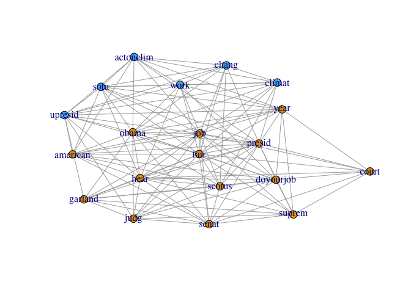
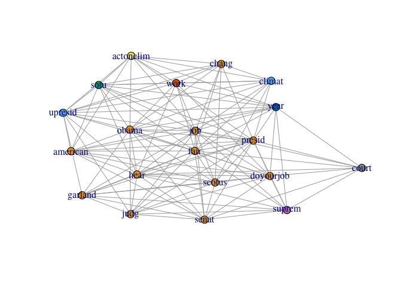
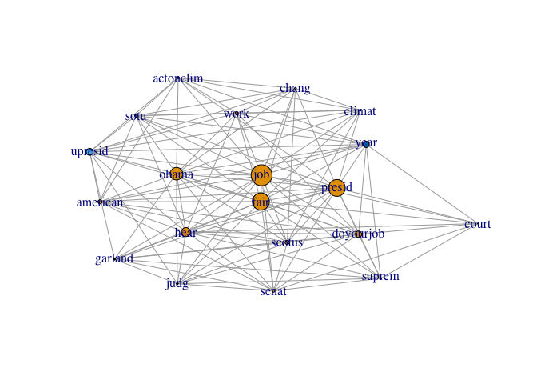
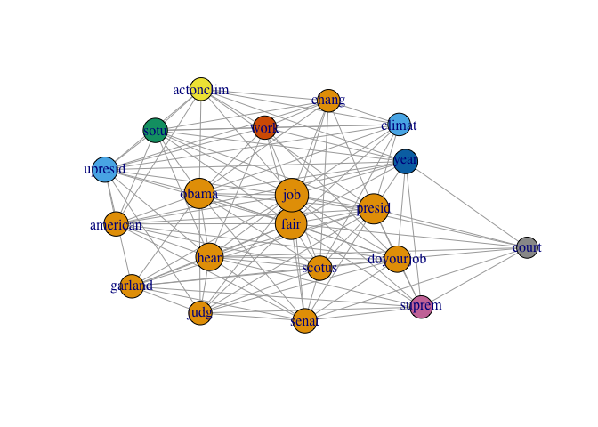

# Twitter term-document-matrix
Hagai Levi  
9 April 2016  


A preface to this work can be found in the [README](README.md).  

We have decided to first show clustering and only then to show the cenrality merics
so that we can include the clusters in the graph when plotting the cenrality merics,
even though it is not the order of the tasks in the assignment.  

We have based on http://www.rdatamining.com/examples/text-mining for retrieving the tweets.


```r
setwd('/Users/hagai_lvi/tmp/data_scientist/assignment_3')
source('./credentials.R')
```


```r
library(twitteR)

# set twitter credentials
setup_twitter_oauth(consumer_key, consumer_secret, access_token, access_token_secret)
```

## Collecting data
The data that we will be using is tweets by Barack Obama.  

```r
maxID <- NULL
n_tweets <- 0
N_TWEETS <- 300
tweets <- NULL
while(n_tweets < N_TWEETS) {
  tmp <- userTimeline("BarackObama", n=200, maxID = maxID)
  maxID <- tmp[[length(tmp)]]$id  
  tweets <- append(tweets, tmp)
  n_tweets <- length(tweets)
}

# Create a dataframe from the data
df <- do.call("rbind", lapply(tweets, as.data.frame))
```

## Basic exploration of the data
Extract a corpus and a TermDocumentMatrix:

```r
# This function returns the most frequent terms in a TermDocumentMatrix
# as a named vector that includes the frequencies
getMostFrequentTerms <- function(dtm, N){
  m <- as.matrix(dtm)
  v <- sort(rowSums(m), decreasing=TRUE)
  head(v, N)
}

cat(sprintf("Matrix dimensions: %i cols, %i rows", ncol(df), nrow(df)))
```

```
## Matrix dimensions: 16 cols, 312 rows
```

```r
library(tm)

# build a corpus, which is a collection of text documents
# VectorSource specifies that the source is character vectors.
myCorpus <- Corpus(VectorSource(df$text))

# all lowercase
myCorpus <- tm_map(myCorpus, content_transformer(tolower))

# remove punctuation
myCorpus <- tm_map(myCorpus, removePunctuation)

# remove numbers
myCorpus <- tm_map(myCorpus, removeNumbers)

# remove stopwords
myStopwords <- c(stopwords('english'), "available", "via")
myCorpus <- tm_map(myCorpus, removeWords, myStopwords)

# stem words in a text document with the snowball stemmers,
# which requires packages Snowball, RWeka, rJava, RWekajars
myCorpus <- tm_map(myCorpus, stemDocument)

# Create a TermDocumentMatrix
myDtm <- TermDocumentMatrix(myCorpus, control = list(minWordLength = 1))
inspect(myDtm[20:30,20:30])
```

```
## <<TermDocumentMatrix (terms: 11, documents: 11)>>
## Non-/sparse entries: 0/121
## Sparsity           : 100%
## Maximal term length: 9
## Weighting          : term frequency (tf)
## 
##                Docs
## Terms           20 21 22 23 24 25 26 27 28 29 30
##   ago            0  0  0  0  0  0  0  0  0  0  0
##   agre           0  0  0  0  0  0  0  0  0  0  0
##   agreement      0  0  0  0  0  0  0  0  0  0  0
##   ahead          0  0  0  0  0  0  0  0  0  0  0
##   ain<U+2019>t     0  0  0  0  0  0  0  0  0  0  0
##   almost         0  0  0  0  0  0  0  0  0  0  0
##   alreadi        0  0  0  0  0  0  0  0  0  0  0
##   also           0  0  0  0  0  0  0  0  0  0  0
##   alway          0  0  0  0  0  0  0  0  0  0  0
##   america        0  0  0  0  0  0  0  0  0  0  0
##   america<U+2019>  0  0  0  0  0  0  0  0  0  0  0
```

Display words associated with obama and american

```r
# which words are associated with "obama"?
findAssocs(myDtm, 'obama', 0.30)
```

```
## $obama
## <U+2014>presid       presid         sotu 
##         0.61         0.57         0.42
```

```r
# which words are associated with "american"?
findAssocs(myDtm, 'american', 0.30)
```

```
## $american
##           cover httpstcoxtyztaa 
##            0.44            0.44
```

Convert to a term matrix

```r
# Transform Data into an Adjacency Matrix
termDocMatrix <- as.matrix(myDtm)

# change it to a Boolean matrix
termDocMatrix[termDocMatrix>=1] <- 1

# transform into a term-term adjacency matrix
termMatrix <- termDocMatrix %*% t(termDocMatrix)

# inspect terms numbered 5 to 10
termMatrix[15:20,15:20]
```

```
##          Terms
## Terms     add address adult advanc afford ago
##   add      11       0     0      0      0   0
##   address   0       4     0      0      0   0
##   adult     0       0     1      0      0   0
##   advanc    0       0     0      2      0   0
##   afford    0       0     0      0      3   0
##   ago       0       0     0      0      0   3
```

The corpus is large, and we can't see clearly a large graph so we are using only a few
frequent items.

```r
library(igraph)

# Get the most frequent words
frequent <- getMostFrequentTerms(myDtm, 20)
frequentTermMatrix <- termMatrix[names(frequent),names(frequent)]
```

## Basic graphs
We construct a graph from the most frequent terms:

```r
# make a binary matrix
frequentTermMatrix[frequentTermMatrix>1] <- 1
g <- graph.adjacency(frequentTermMatrix, mode = "undirected")

# remove self loops
g <- simplify(g)
V(g)$degree <- degree(g)

# Plot the Graph
# set seed to make the layout reproducible
set.seed(100)
lay <- layout.kamada.kawai(g)
plot(g, layout=lay)
```


## Clustering

### `walktrap` clustering
Adding clustering using the `walktrap` strategy:

```r
# Now add clustering to the graph
community <- walktrap.community(g)
plot(g, layout=lay, vertex.size=5, vertex.color=community$membership, asp=FALSE)
```



We got 2 communities. The size of each community:


```r
sizes(community)
```

```
## Community sizes
##  1  2 
## 12  8
```

The modularity we got:

```r
modularity(community)
```

```
## [1] 0.1143865
```

### `edge betweenness` clustering

Now clustering using the `edge betweenness` strategy:

```r
# Now add clustering to the graph
community <- edge.betweenness.community(g)
plot(g, layout=lay, vertex.size=5, vertex.color=community$membership, asp=FALSE)
```



We got 9 communities. The size of each community:


```r
sizes(community)
```

```
## Community sizes
##  1  2  3  4  5  6  7  8  9 
## 12  1  1  1  1  1  1  1  1
```

The modularity of `edge betweenness`:

```r
modularity(community)
```

```
## [1] 0.0303288
```

## Centrality metrics

### Betweenness
We want to show the betweenness of each term: 

```r
t(betweenness(g))
```

```
##         obama   presid   <U+2014>presid     sotu doyourjob     fair    senat
## [1,] 7.043687 9.198449       3.738528 1.413925  3.307576 7.096068 1.339286
##      actonclim      job     year     hear     work   garland      judg
## [1,] 0.6761905 11.37742 4.178571 4.686111 1.741703 0.8650794 0.8650794
##        scotus    suprem     court     chang   economi american
## [1,] 1.172222 0.7873377 0.2159091 0.9289683 0.2833333  3.08456
```

And plot it on the graph, together with the clusters:

```r
plot(g, layout=lay, vertex.color=community$membership, vertex.size=betweenness(g), asp=FALSE)
```



### Closeness

```r
t(closeness(g))
```

```
##           obama     presid   <U+2014>presid       sotu  doyourjob       fair
## [1,] 0.04761905 0.04761905           0.04 0.03846154 0.04166667 0.04761905
##           senat  actonclim        job year       hear       work
## [1,] 0.03846154 0.03571429 0.05263158 0.04 0.04347826 0.03703704
##         garland       judg     scotus     suprem      court      chang
## [1,] 0.03703704 0.03703704 0.03703704 0.03571429 0.03333333 0.03448276
##         economi american
## [1,] 0.03448276     0.04
```

```r
plot(g, layout=lay, vertex.color=community$membership, vertex.size=closeness(g), asp=FALSE)
```


And as closeness generates small values, we will increases the vertexes size:

```r
g.closeness <- closeness(g)
g.closeness.normalized <- 10 * (g.closeness / min(g.closeness))
t(g.closeness.normalized)
```

```
##         obama   presid   <U+2014>presid     sotu doyourjob     fair    senat
## [1,] 14.28571 14.28571             12 11.53846      12.5 14.28571 11.53846
##      actonclim      job year     hear     work  garland     judg   scotus
## [1,]  10.71429 15.78947   12 13.04348 11.11111 11.11111 11.11111 11.11111
##        suprem court    chang  economi american
## [1,] 10.71429    10 10.34483 10.34483       12
```

```r
plot(g, layout=lay, vertex.color=community$membership, vertex.size=g.closeness.normalized, asp=FALSE)
```



### Eigen values

**For eigenvalues, we will not show a graph, due to negative values.**


```r
eigen_values <- eigen(frequentTermMatrix)$values
names(eigen_values) <- colnames(frequentTermMatrix)
eigen_values
```

```
##         obama        presid <U+2014>presid          sotu     doyourjob 
##  1.420202e+01  5.779579e+00  3.021264e+00  2.066587e+00  1.715053e+00 
##          fair         senat     actonclim           job          year 
##  1.350975e+00  1.008737e+00  5.667674e-01  3.359059e-01  1.872261e-16 
##          hear          work       garland          judg        scotus 
##  1.227066e-16 -1.776357e-15 -1.738442e-01 -5.949431e-01 -7.581790e-01 
##        suprem         court         chang       economi      american 
## -9.208352e-01 -1.257237e+00 -1.548359e+00 -2.331891e+00 -2.461598e+00
```
